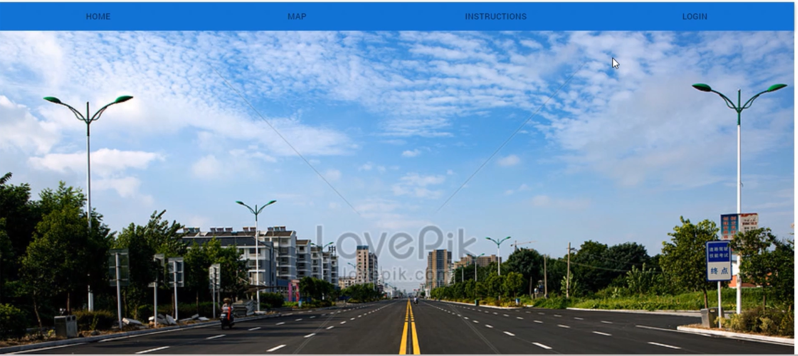
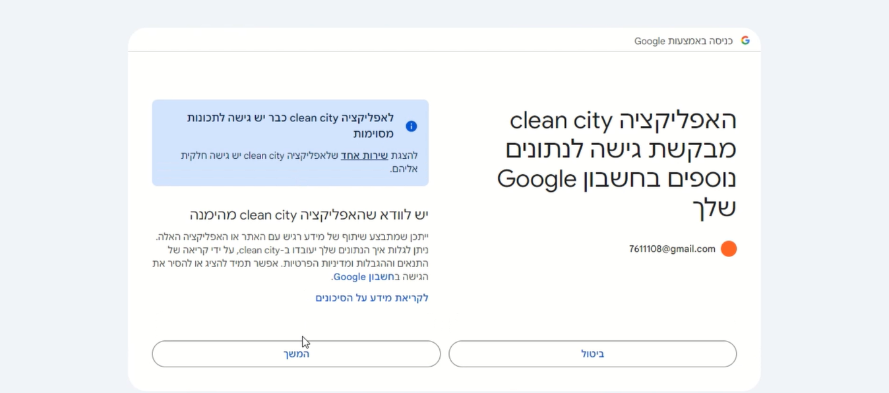
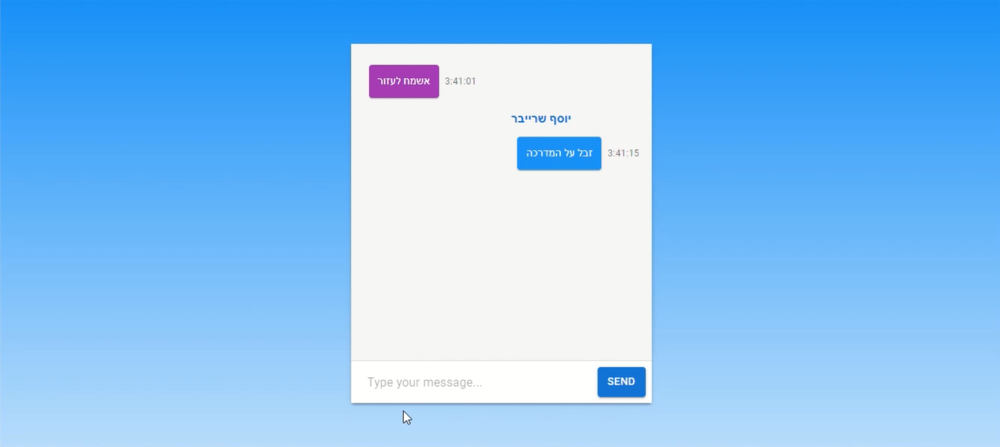
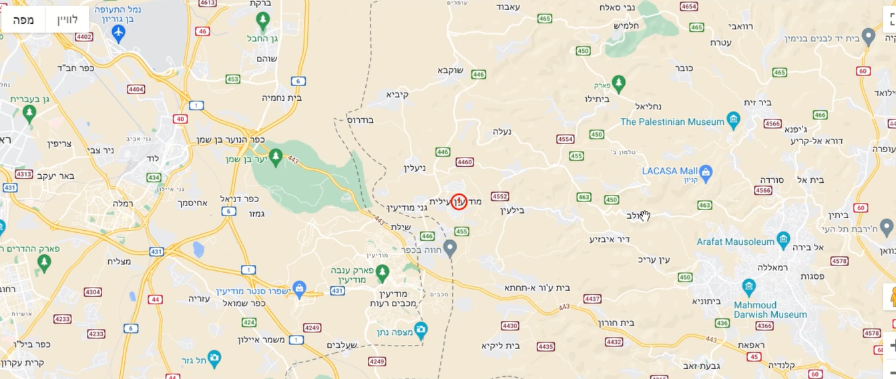
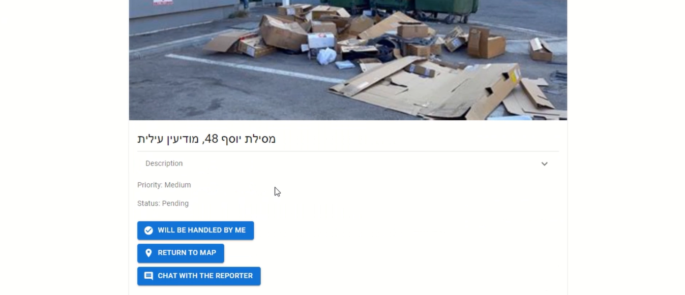

# City Task and Issue Management System

This project provides an efficient platform for managing city issues and tasks, allowing seamless reporting and tracking of city-related problems. It features a Google login integration and distinct user roles for city residents and city employees.

## Features

### For City Residents
- **Report City Issues**: Residents can easily report issues they encounter in the city.
- **Location Selection**: Reports can be submitted by either:
  - Selecting a specific location on the map.
  - Choosing an exact address.
- **Detailed Reporting**: After selecting a location, a window opens for entering issue details, attaching images, and submitting the report.
- **Real-Time Chat**: Residents can communicate directly with the city worker assigned to resolve the issue.
- 

### For City Employees
- **One-Time Registration**: Upon first-time login, employees register with the system. Subsequent logins are recognized automatically through Google.
- **Map Overview**: Upon login, employees see a city map highlighting areas with reported issues.
  - Issues are filtered based on the employee's specific field and expertise.
  - 

- **Issue Claiming**: Employees can claim tasks, indicating that they are responsible for resolving specific issues.
  - Once claimed, the issue becomes invisible to other employees in the same field.
  - 

- **Task Completion**: When a task is completed, the employee marks it as done, removing it from their task list and clearing it from the map.

### Project Benefits
This system streamlines issue and task management across the city, eliminating the need for a centralized human coordinator. With a user-friendly interface, it offers precise, efficient, and organized management of city reports.

---

